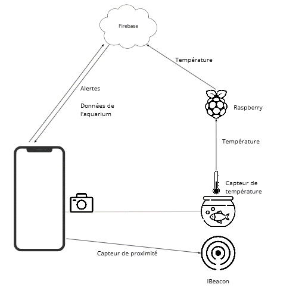
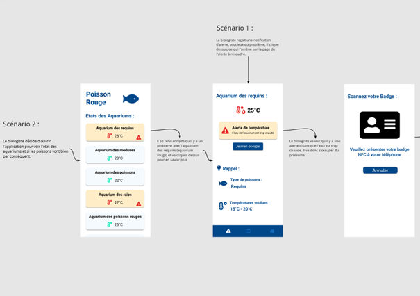
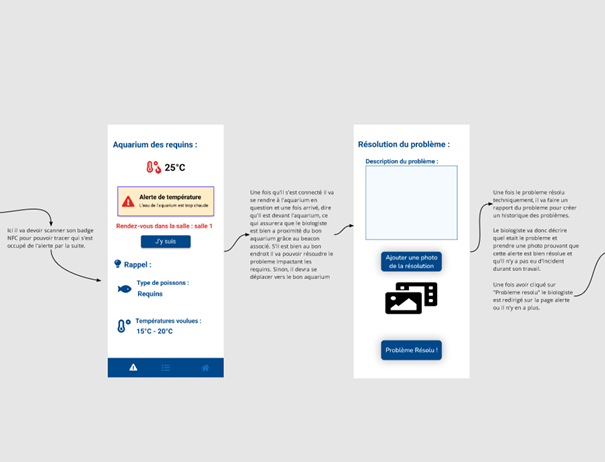
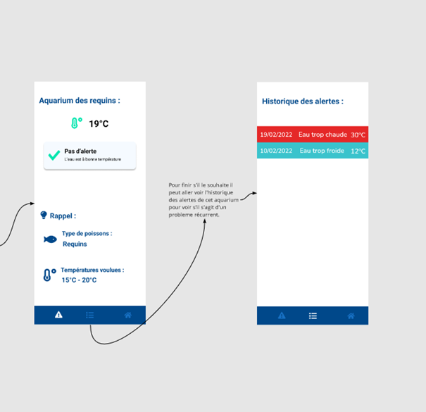

# PoissonsRouges

Lien du miro : [https://miro.com/app/board/uXjVORPMtRw=/?invite_link_id=389042144776](https://miro.com/app/board/uXjVORPMtRw=/?invite_link_id=389042144776)

Réalisé par les étudiants de la LP CDTL de la Rochelle : 
 - Belot Valentin
 - Nulens Quentin
 - Thinnes Léo

## Le projet

Pour vivre en bonne santé dans leurs aquarium (voire vivre tout court), les poissons doivent baigner dans une eau à température adéquate. Notre projet doit répondre à cette problèmatique. 

La témpérature de chaque aquarium est affichée dasn la page d'accueil et permet de surveiller les variations. Lorsque que la température franchit la barre du dessous ou celle du dessus, l'utilisateur reçoit une notification : une alerte. 

La notification ammène l'utilisateur dans la page de détail de l'aquarium, qui va contenir l'alerte.

Pour assigner l'alerte à tel utilisateur, ce dernier pourra "prendre l'alerte" puis passer sa carte NFC pour l'identifier. Lui seul pourra s'occuper de l'alerte à partir de là, il est invité à se rendre devant l'aquarium pour résoudre le problème. 

L'utilisateur biologiste devant l'aquarium, pourra vérifier qu'il est dans la bonne salle. L'application détectera le ebeacon de l'aquarium pour être sûr qu'il s'agisse bien du bon. S'il s'agit du bon, le biologiste peut remettre l'eau à bonne température. Un fois cela fait, il pourra prendre un photo et noter le souci pour clotûrer l'alerte. L'alerte clôturée sera stockée dans l'historique de l'aquarium. 

## Taches réalisées (et non réalisées)

Tâches réalisées :
 - Liste des aquariums avec les températures actualisées
 - Détail de l'aquarium avec une alerte
 - Fonctionnement de la notification, et redirection vers l'aquarium concerné
 - Passage de la carte NFC, attribution de l'utilisateur à l'alerte
 - Détection du beacon
 - Clôturation de l'alerte
 - Historique des alertes

 Tâches non réalisées :
 - Enregistrement de la photo en base de données et récupération : souci technique
 - Cacher l'alerte pour les utilisateurs à qui elle n'est pas attribuée : manque de temps, à envisager plutôt pour une V2

 ## Bugs connus

 - Conflit entre les températures si jamais plusieurs alertes sont générés en même temps (la température dans la liste ne sera pas la même que dans le détail, le produit final est fait pour gérer une seule alerte à la fois)
 - L'alerte ne sera pas à jour dans le détail si on ne passe pas par la notification
 - La notification ne disparaît pas une fois qu'on clique dessus : manque de temps
 - Parfois, l'alerte a déjà un utilisateur définit : souci technique, ne trouve pas d'où ça peut venir

 ## Diagramme 
 

 ## Mode d'emploi
 
 
 
